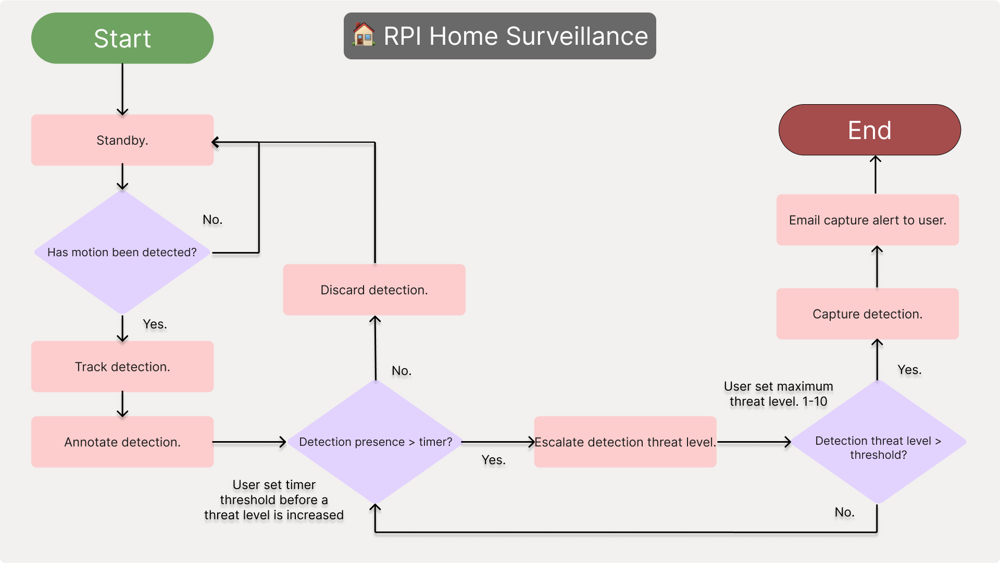
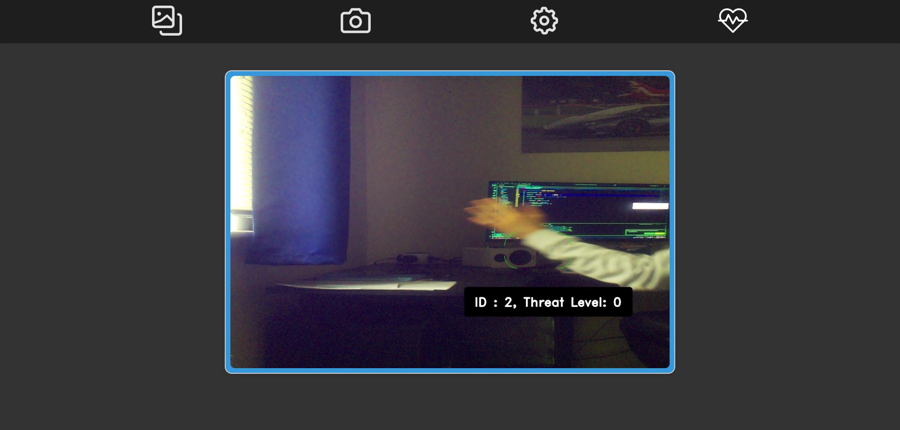
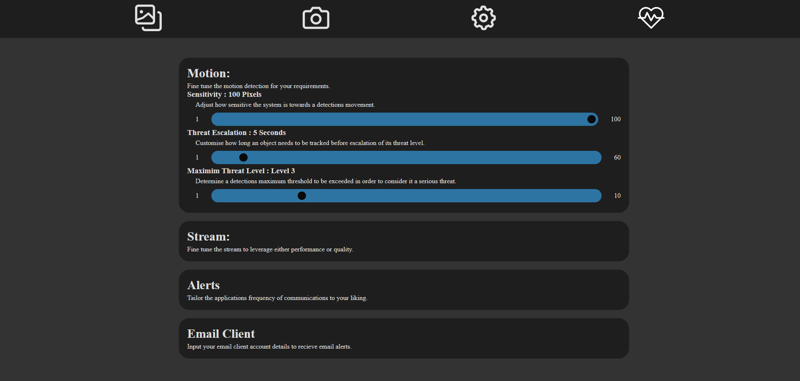
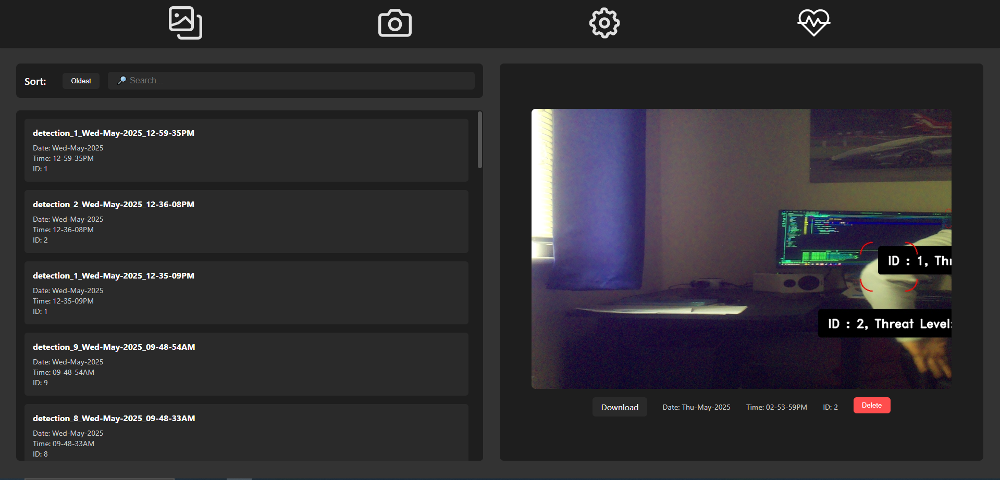
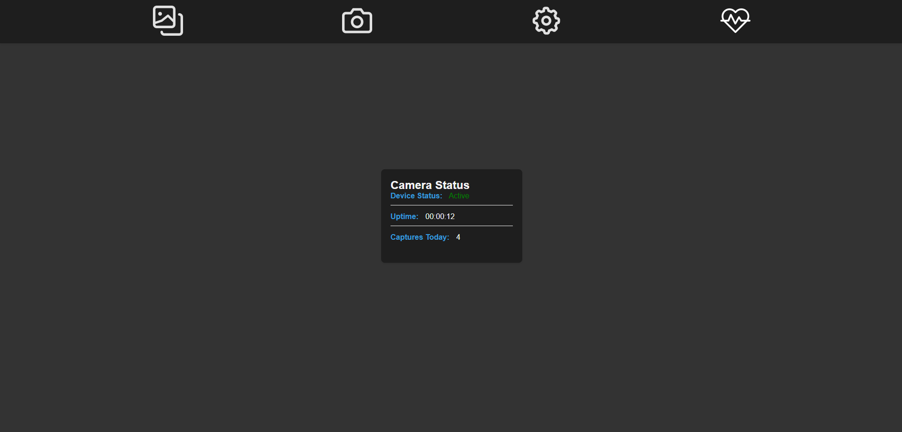

# 🏠-RPI-Home-Security-Project

This is the current, up to date, refinement of a longtime personal vision: a modern, accessbile home surveillance sysytem leveraging simple, yet effective computer vision 
techiques. There is potential, with enough time, this will develop further. 

# 🎯 Mission

The mission is to provide an --accessible and customizable home security system--.

Unlike many current, proprietary, monetised and complex systems that rely on cloud-based surveillance and limit user control, this project keeps you in charge.
All processing is handled locally, meaning your data stays yours.

# 💡 Why

For many, security is no longer a luxury, more of a necessity. Whether it is protecting your personal space/belongings, or rude neighbours playing petty. Most current, commercialised 
offerings are often too expensive and limiting with the tools that they offer. Creating a barrier to entry. 

- Privacy by design.
- Low cost hardware. (camera module £2 from Amamzon, Rpi4 £50 -- EVERYTHING ELSE FREE)
- Email Notifications (NO COST).
- Great for understanding fundamental computer vision concepts. 

## 📖 Table of Contents

---
1. [Flowcharts](#-flowcharts)
2. [Features](#-features)
3. [Navigation](#-navigation)
4. [Prerequisites](#-prerequisites)
5. [Setup](#-setup)
6. [Configuration](#️-configuration)
7. [RunningTheProject](#️-run)
---

## 📊 Flowcharts

This flowchart details the systems proprietary logic, an attempt to mitigate false positives in busy, urban environments, considering lingering detections as potential threats.

## 🚀 Features

    ✔️ Motion Detection
    ✔️ Object Tracking
    ✔️ Detection Annotations
    ✔️ Customizable Settings
    ✔️ Flask Web Server
    ✔️ Email Alerts

## Navigation

A brief introduction into what you, the user will see and what each page offers. 

### Homepage

This is the main landing page you will be initially greeted with where you can access the camera and see what it is observing in real time. 

### Settings

The settings page has its main controls compartmentalised into sub categories which are accessed via the dropdowns. These will be updated after you have made your required
changes to the field. Should updating the JSON file camera_settings.JSON, there are backup default values.

### Captures

Captures will present all of the events captured by your device. These can be accessed for viewing, download or deletion. They can also be sorted by date and filtered with the searchbar. 

### Status

The status page will give you realtime values on the cameras status, its operation and how many captures have been taken that day.

## 🔧 Prerequisites

    > 📌 -Note: This project assumes a basic understanding of Raspberry Pi and Linux terminal usage.-
    - In order for this project to be viable, these components are required. 

    ### Hardware:

        - Raspberry Pi (--Model 4B onwards)
        - Pi Camera Module V2
        - MicroSD (--min 16GB, --class 10)
        - Internet Connection

    ### Software:

        - Raspberry Pi OS (Insert tutorial link here.)
        - Python 3.11
        - Gmail Account (FREE -- Required for email client to send alerts.)

## 🛠 Setup

Clone this git repo with:

    - git clone https://github.com/MichaelwaveOfficial/rpi_security_system_rebuild_25.git

    - cd project folder

Install dependencies:

    - sudo apt update
    - sudo apt upgrade
    - sudo apt install -y python3-picamera2
    - pip install -r requirements.txt 

## ⚙️ Configuration

    - setting up email alerts.

    In order for the email alerts to work, you will need to generate an app password from your google account
    which will 

    1. Log into current/create a new gmail account.

    2. Find Security > App Passwords.

    3. generate app password in settings, keep that safe!

    4. Update the .env file with your credentials:

        - APP_EMAIL=example@gmail.com
        - APP_PASSWORD=your-generated-app-password
        - TARGET_EMAIL=recipient@email.com

## ▶️ Run

Run the project:

    - python main.py
